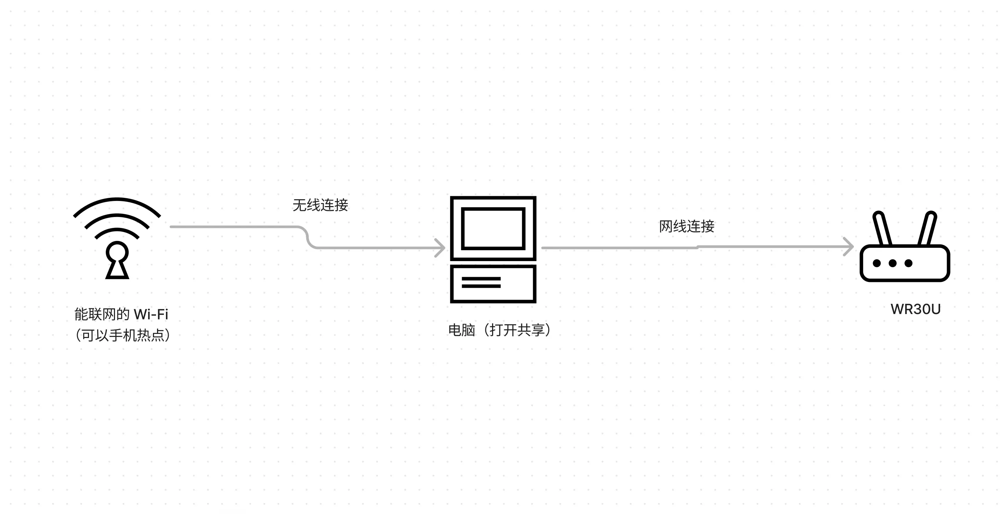
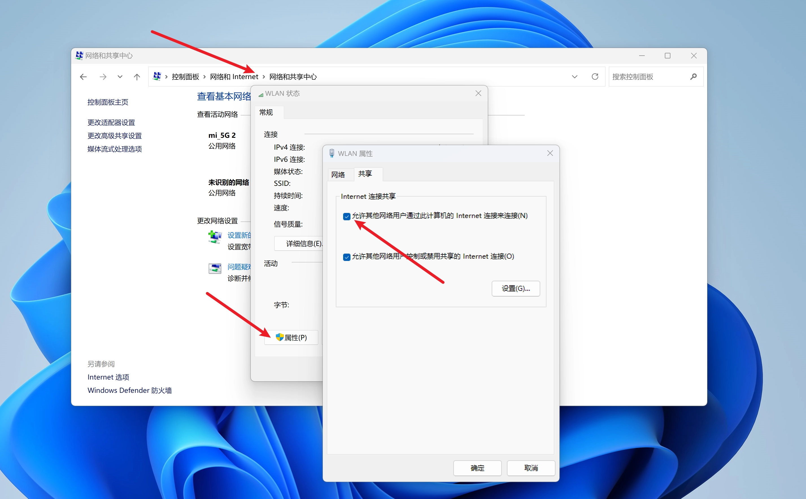

# 解锁 wr30u_ssh_go

1. wr30u 先不需要插网线，电脑提示没有网络没有影响，打开 192.168.31.1 后台，在常用设置-上网设置里分别设置：

        上网设置 DHCP，自动配置 DNS
        启动与智能网关无线配置同步（会重启）
        固定 WAN 口为 1 （会重启）

2. 配置准备电脑：

        电脑连接家里已有的能正常上网的 WiFi（不是解锁的 wr30u 的 WiFi），然后将电脑用网线与 wr30u 连接。
        打开控制面板-网络和Internet-网络和共享中心-选择WLAN-点击属性-共享-勾选第一个允许-确认。
        这个时候 wr30u 应该能连接网络，指数灯也会从黄灯变为蓝色。

     
     


# wr30u_ssh_go

`PatriciaLee3/wr30u_ssh` 中 `server_emulator.py` 的 Go 移植版。

## 特点

- 单个 Windows `.exe`，无需安装 Python 或 `pycryptodome`
- 仅使用 Go 标准库
- 默认监听 TCP `0.0.0.0:32768`
- 默认将路由器 SSH 密码设为 `admin`
- 使用 `io.ReadFull`，避免 TCP 分包时一次读取不到完整报头

## Windows 直接使用

1. 按原项目 README 配置 WR30U、Windows 网络共享和网线连接。
2. 以普通命令提示符或 PowerShell 运行：

```powershell
.\wr30u_ssh_windows_amd64.exe
```

3. 出现设备信息后按 Enter。
4. 完成后使用 `root/admin` 登录 SSH。

Windows 防火墙首次询问时，需要允许程序在当前网络上监听；否则路由器无法连接 TCP 32768。

## 参数

```text
-listen :32768       监听地址，默认 :32768
-password admin      设置 root 密码，默认 admin
-auto                设备注册后不等待 Enter，直接执行
```

例如：

```powershell
.\wr30u_ssh_windows_amd64.exe -password "YourPassword"
```

## 自行编译

在 Windows 安装 Go 后，在源码目录执行：

```powershell
go build -trimpath -ldflags="-s -w" -o wr30u_ssh.exe .
```

从 Linux/macOS 交叉编译 Windows x64：

```bash
CGO_ENABLED=0 GOOS=windows GOARCH=amd64 go build -trimpath -ldflags="-s -w" -o wr30u_ssh_windows_amd64.exe .
```
